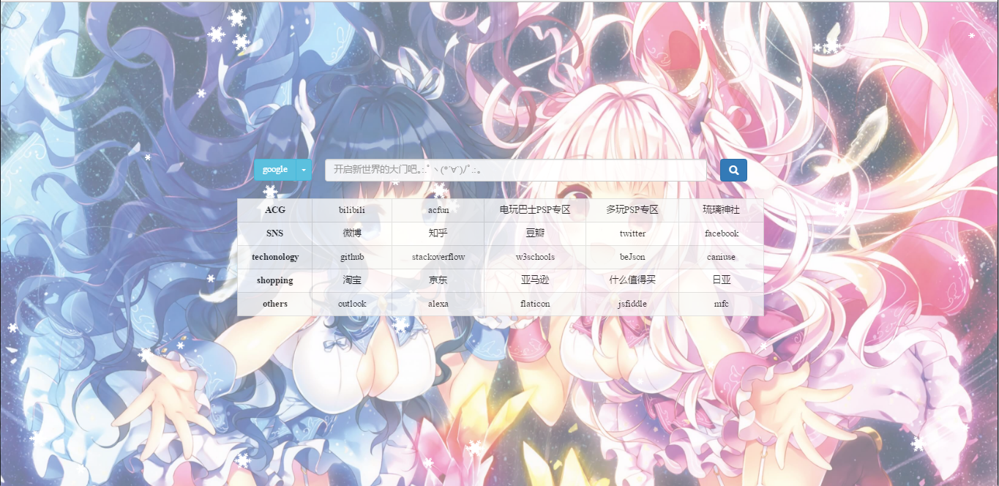
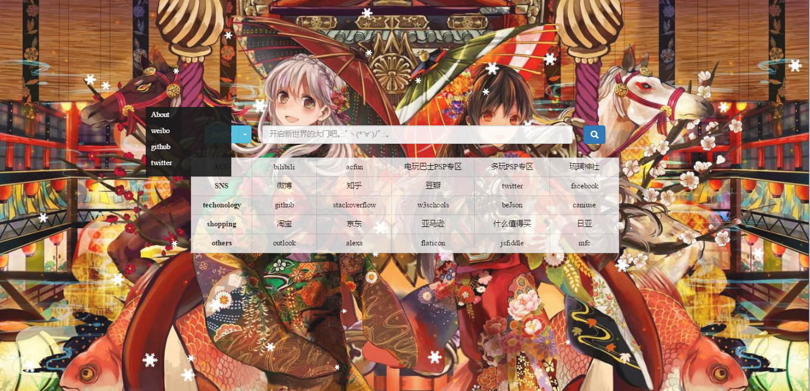

# introduce
A (๑• . •๑) Navigation Stie.

# screenshot

# style
* static pages
* use the gh-pages severce
* Q : how to use the website i can't visit? A : [click here](https://github.com/racaljk/hosts)
* when press the key of "`" can refresh the background images
* when press the key of "p" can play music

# [website](https://love999262.github.io/moe/src/moe.html)
